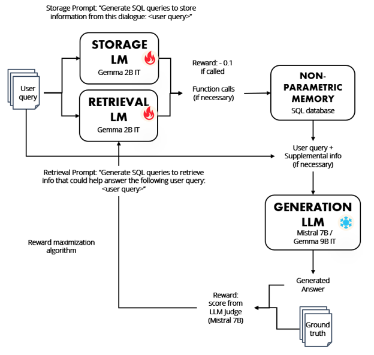
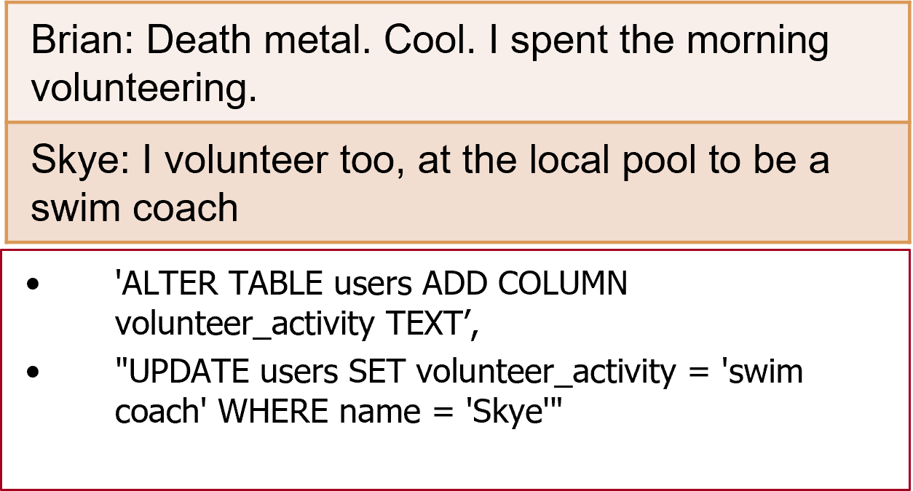
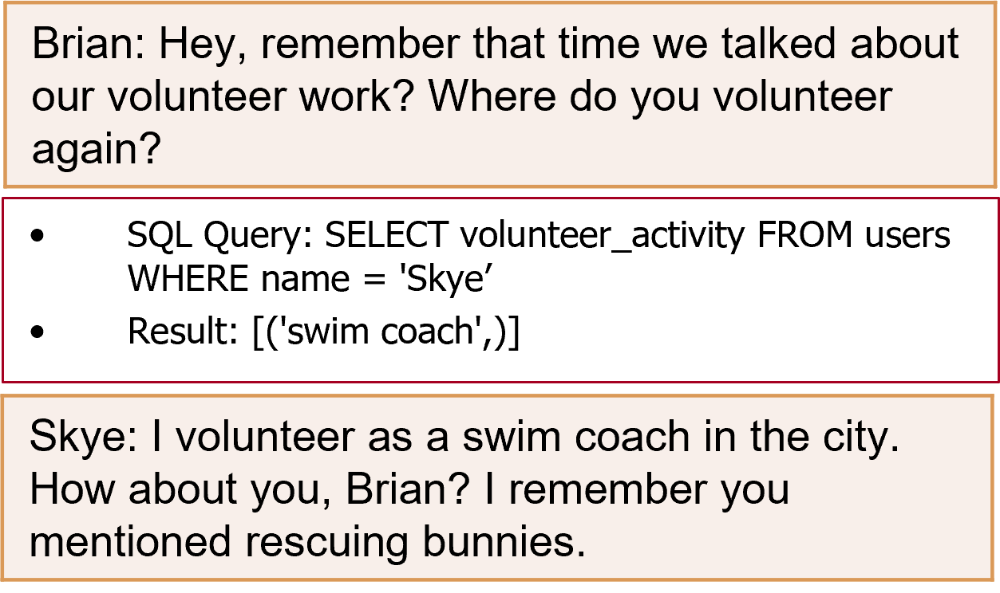
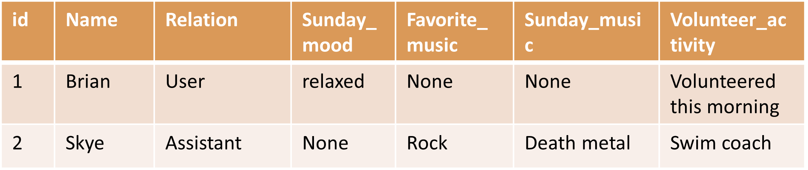
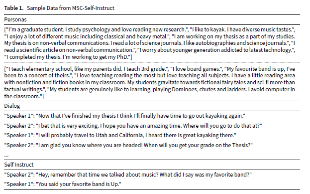
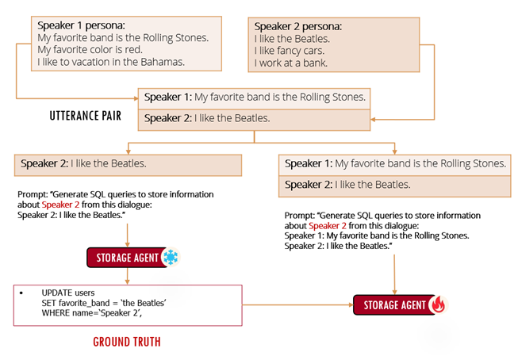
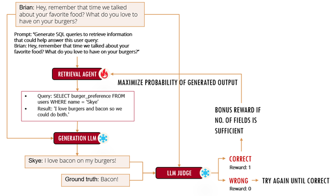
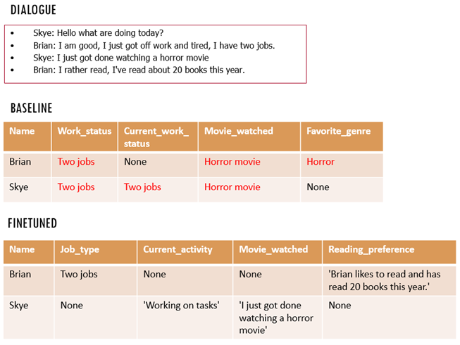
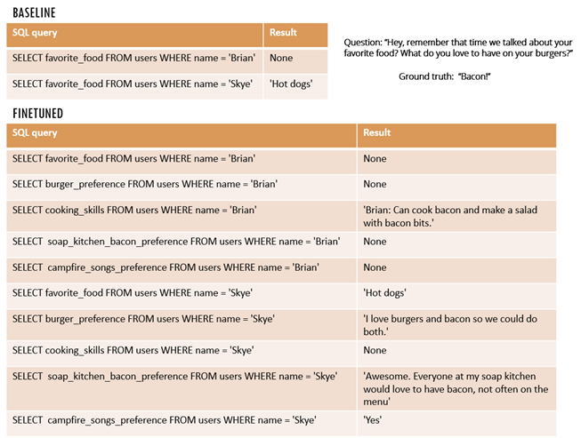

# Topic 2: Long Term Memory Using SQL Language Models

This is an implementation of a chatbot that uses a team of language models (agents) that generate SQL commands that are executed to store and retrieve memories into and from an external SQL database.

## Latest Weights

Latest (LoRA) weights for the storage language model:
sql_memory/sql_storage_200(0.985)/

*The base model is "google/gemma-2-2b-it", the tokenizer inside the checkpoint is from this model

*URL: https://huggingface.co/google/gemma-2-2b-it/tree/main

## Environment

Tested on Windows 10 and Ubuntu 24 with Python 3.12 with a single RTX 3080 TI / RTX 4090
(To run the training code and any experiments involving Gemma 9B may require at least 24GB of VRAM i.e. RTX 4090)

## Setup Instructions

Create a new conda environment

[`pip install -r requirements.txt`]

## Chatbot With Long Term Memory Demo

Run [`interact2.py`] to start a dialogue session

Engage in dialogue with the chatbot (but do not tell the chatbot your name: this needs to be fixed at its default for now)

As you converse with the chatbot, language models will save important facts to the SQL database automatically.

To exit the dialogue session and save the stored information enter the keyword "bye" and hit enter.

To delete the stored information and reset the database enter the keyword "reset" and hit enter.

If you entered "bye" to exit the session, the next time you run [`interact2.py`] it will load the stored information from the database and you can check whether it remembers all the facts you told it.

## Evaluation

To evaluate the performance of the SQL language models in storing and retrieving memories on the MSC dataset:

1. Run [`eval_without_judge.py`]. This will generate predicted answers and store them in the file ['eval_record.txt'].

2. Run [`eval_LLM_judge.py`]. This will calculate the LLM judge score for the predicted answers.

## Training

Run [`train(C3)singlelines_reward_overlapping_S.py`] to finetune the storage language model using reinforcement learning.

This will generate checkpoints for the storage language model every 50 iterations ['sql_storage_i']. 

Currently the best performing model appears to be the one saved at the 200th iteration (already saved in this folder as ['sql_storage_200(S0.985)']).

## Concept

Non-Parametric Memory: LM SQL Storage/Retrieval Training using Reinforcement Learning
- Setup a team of small language models (Gemma 2B), one to store information from dialogue into a SQL table, one to retrieve information from SQL table
- Trained the two models on reward respecting subtasks using reinforcement learning to store and retrieve more relevant information
- Tested the resulting models (using Mistral 7B for generation) on Multi-Session Chat dataset and were able to increase accuracy from 0.56 to 0.76

Storage LM

Small language model stores information about user and AI assistant from dialogue into SQL table

Retrieval LM

Small language model retrieves information about user and AI assistant from SQL table when necessary to answer user query

The storage language model generates SQL queries to store information from dialogue into a SQL table:

The retrieval language model generates SQL queries to retrieve information from the SQL table:

Example SQL table after updating using the storage language model:

### Dataset

The dataset used for training and evaluation is the MSC-Self-Instruct dataset:

MSC-Self-Instruct

- 5 Dialogue sessions per multi-session chat + Q/A pair to test memory
- 500 multi-session chats total
- Evaluation: LLM Judge vs GT answer

URL: https://huggingface.co/datasets/MemGPT/MSC-Self-Instruct

### Training

Training the storage language model on a reward respecting subtask using reinforcement learning:

The storage language model is trained to maximize the likelihood of generating SQL queries to store only the information pertaining to the speaker in question.
This is done by generating the ground truth from a prompt that includes only the line for the speaker in question.

Training the retrieval language model on a reward respecting subtask using reinforcement learning:

The retrieval language model is trained to maximize the likelihood of the SQL queries it generates only in the case that it results in the final answer being correct.
Then a bonus is added if the number of fields retrieved falls within the desired range.

### Evaluation

Qualitative Results

Storage LM before and after finetuning:

Before finetuning the storage LM confuses the records for the two speakers resulting in incorrect entries.
After finetuning the storage LM is able to correctly distinguish which record to update.

Retrieval LM before and after finetuning:

Before finetuning the retrieval LM does not retrieve a sufficient number of fields to answer the query.
After finetuning the retrieval LM retrieves enough fields to correctly answer the query.

Quantitative Results

As judged by the LLM judge (Mistral 7B) the final answer after storing all the information from the dialogue history into the SQL table using the storage LM and retrieving using the retrieval LM,
was correct only 56% of the time on a held-out test set of 50 questions using just the baseline Gemma 2 9B model for storage and retrieval.
Using our finetuned models the accuracy increased to 76% on the same test set.
