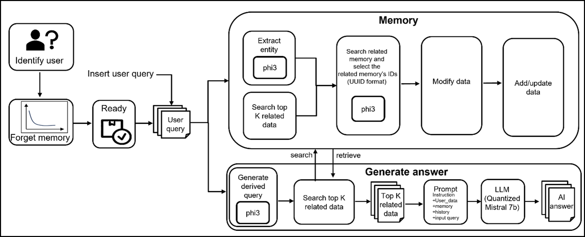
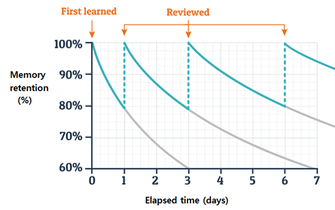
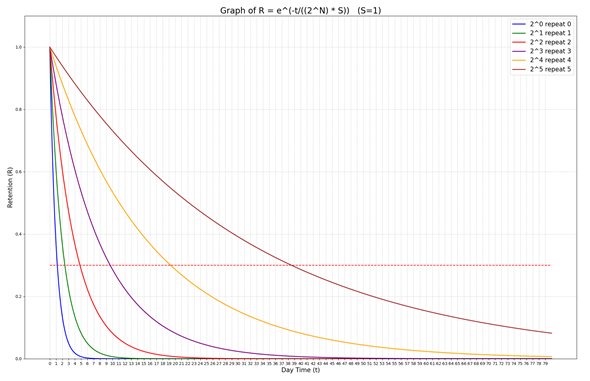
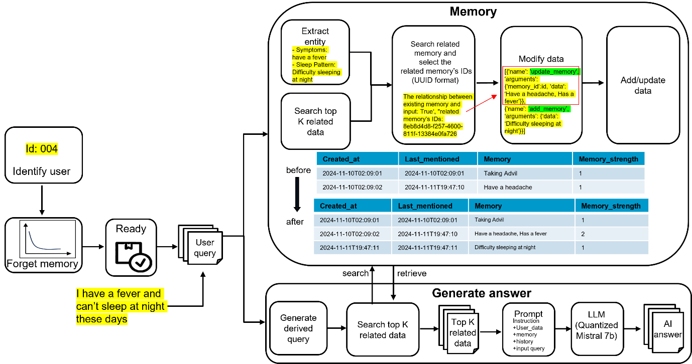
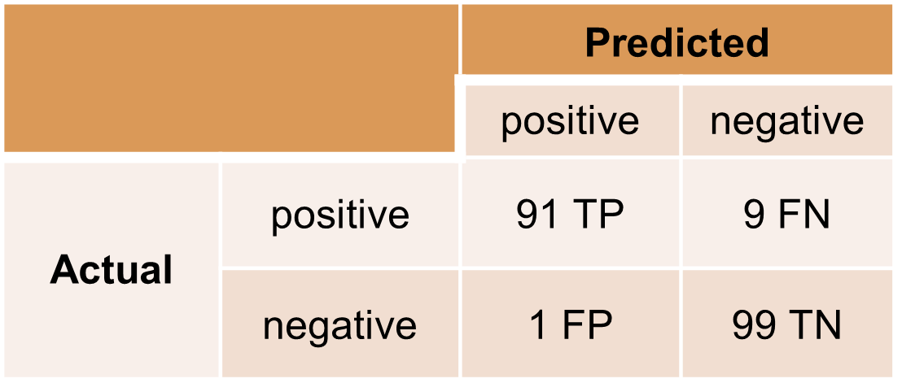
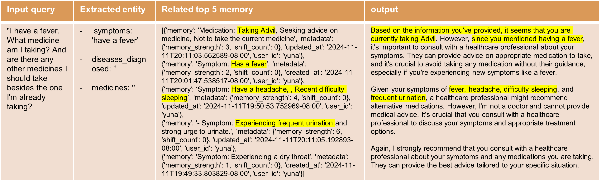
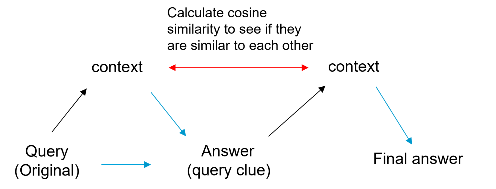
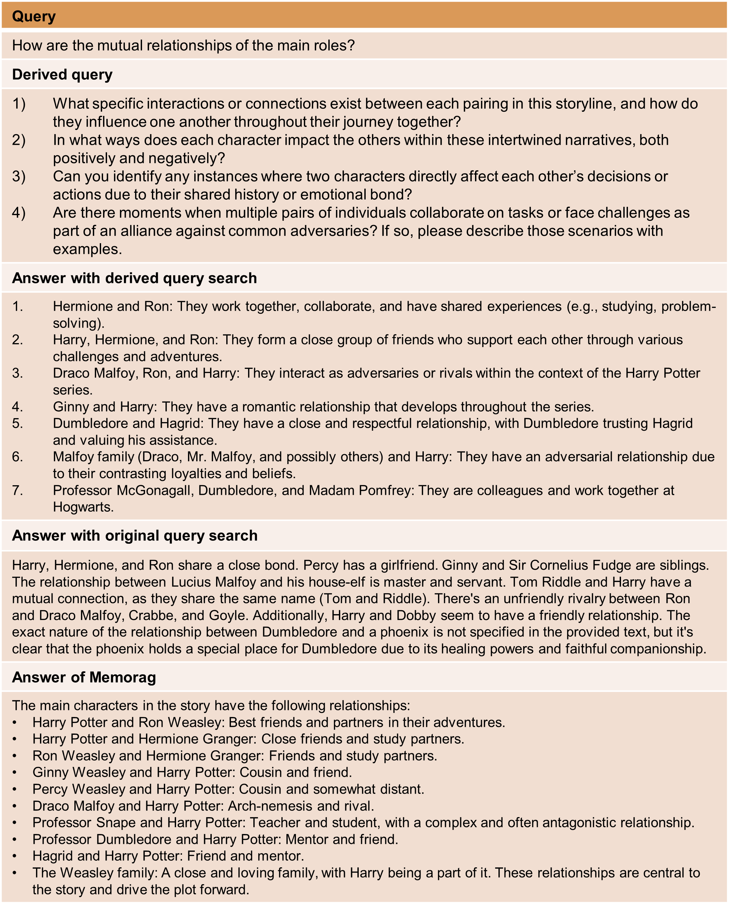
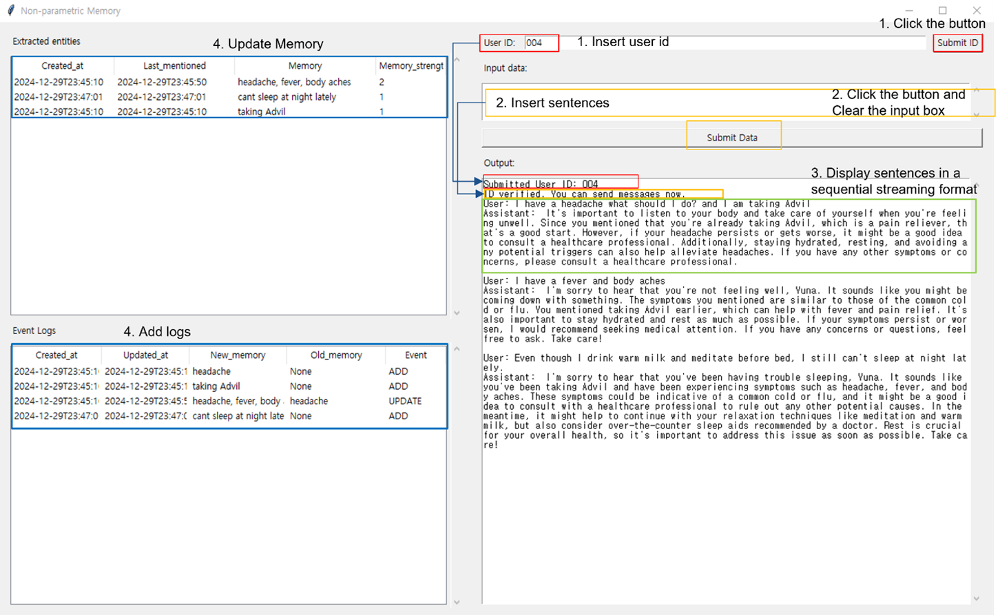

# Long-term Memory Using Entity and Chromadb
The model is structured with a non-parametric memory that stores important elements of a user query as entities in ChromaDB, and retrieves relevant memories based on the user query.

## Installation
Tested on Windows 10 with Python 3.9 and CUDA version 11.6 or higher. And NVIDIA GeForce RTX 3090, NVIDIA GeForce RTX 2080 Ti.
The NVIDIA GeForce RTX 3090 alone is not working due to an out of memory error.

The mem0ai library on GitHub is continuously updated, so only version 0.1.7 is allowed. 
Then, go to the mem0ai folder installed in the Anaconda virtual environment and replace the files mem0/memory/main.py, mem0/configs/prompts.py, mem0/embeddings/bge_base.py, mem0/vector_stores/chroma.py, and mem0/llms/phi3.py with the submitted files.
After that, to recognize the replaced LLM, go to mem0/utils/factory.py and add "phi3": "mem0.llms.phi3.Phi3LLM" to the ‘provider_to_class’ dictionary.

How to Install GPU-Enabled llama-cpp-python (Visual Studio 2019 and CMake must be installed beforehand):
1. set FORCE_CMAKE=1 && set CMAKE_ARGS=-DLLAMA_CUBLAS=on
If DLLAMA_CUBLAS doesn’t work, use the following alternative: set FORCE_CMAKE=1 && set CMAKE_ARGS=-DGGML_CUDA=on
2. pip install llama-cpp-python --force-reinstall --upgrade --no-cache-dir  or  pip install llama-cpp-python --force-reinstall --upgrade --no-cache-dir -vv
Installing the GPU version may take about 2 hours.

For all other dependencies, you can install them using the requirements submitted.

## Demo
The attached demo folder's 004.db (demo/004.db) is needed to check the user's personal information, and the 004 folder (demo/004) is the chromadb folder that stores the memory content. (The attached folder contains an empty database, provided only to indicate its location.)
1. After running server.py, execute the client.py file once the execution is complete.
2. If you enter a user ID, the chat session will start immediately if the user is already registered. At this point, the 004.db data from the demo folder that was created in advance should be available. (At this time, the name of the database is the user's ID, and if the user is not registered, registration will not occur at this time. You can register it separately using the save_base function in server.py.)
3. During the conversation, enter dialogue sentences and press enter. (To store user information, only sentences related to diseases, symptoms, and medications should be entered. Any content unrelated to these topics will not be saved.)
4. To exit the conversation session, type the keyword "Exit" and press enter.

## Server Client Setup
On the server side, run [server.py]. This will start a server that listens for incoming connections.
On the client side, run [client.py]. This will connect to the server and start a dialogue session.
Websocket url = ‘ws://localhost:8000/LLM’ 

## Concept

- A small language model (phi-3 3.8B) compresses information from the user's words in the conversation and stores it as a vector embedding in chromadb or updates the memory if it already exists.
- Older memories are deleted using the number of mentions and the mentioned date along the Ebbinghaus' forgetting curve.
- Relevant memories are retrieved from the database using cosine similarity between embeddings of of the memories and the user's query
- Currently, the queries are relatively simple, but we are implementing Memorag in preparation for when more complex queries need to be used in the future.

### RAG-BASED MEMORY OVERALL STRUCTURE

### GRAPH CHANGES BASED ON THE NUMBER OF MENTIONS ON DIFFERENT DATES
citation: https://www.rebuildingeducation.com/the-algorithm-that-saves-lives/

 
 

### CHANGE IN GRAPH SLOPE WITH REPETITION

### RAG-BASED MEMORY PROCESS WITH EXAMPLE

### AI ANSWER OF EXAMPLE

### __Dataset__   
1. Medialog dataset (num 100) 
https://huggingface.co/datasets/UCSD26/medical_dialog/blob/main/medical_dialog.py  
2. MSC-self-instruct dataset (num 100)  
https://huggingface.co/datasets/MemGPT/MSC-Self-Instruct

### EXTRACT ENTITY CONFUSION MATRIX  

### RESULTS GENERATED DURING THE PROCESS

### __Dataset__ 
1. harry potter (HARRY POTTER AND THE CHAMBER OF SECRETS)
https://github.com/qhjqhj00/MemoRAG/blob/main/examples/harry_potter.txt
2. Create complex queries that require a combination of fragments and answers using chatgpt  
Example: How is 'prejudice' addressed in this book?, What's the book's main theme? 

### RELATIONSHIP BETWEEN ORIGINAL QUERY, CONTEXT, AND DERIVED QUERIES

### COMPARISON OF QUERY SEARCH AND ANSWER, DERIVED QUERY SEARCH AND ANSWER, AND MEMORAG ANSWER EXAMPLE

RAG-BASED MEMORY SYSTEM: GUI OVERVIEW

